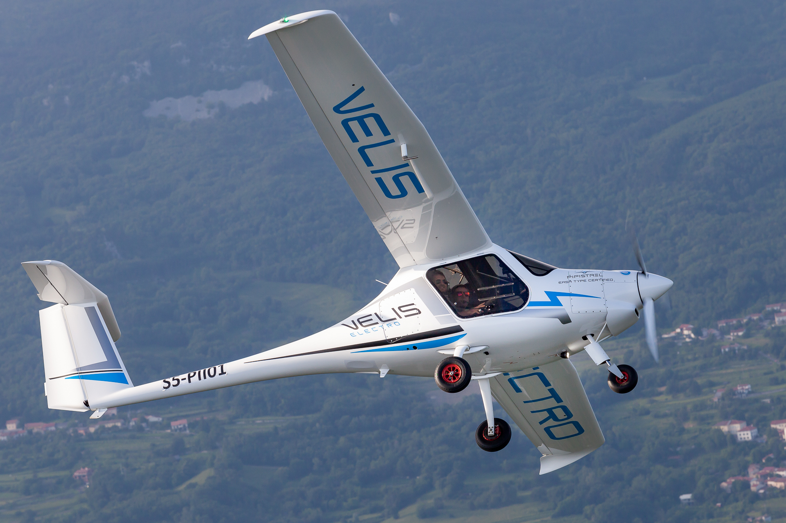
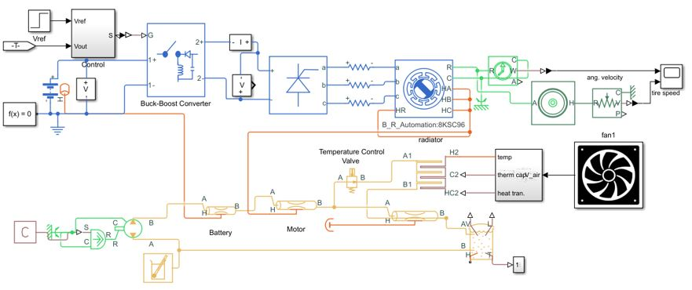
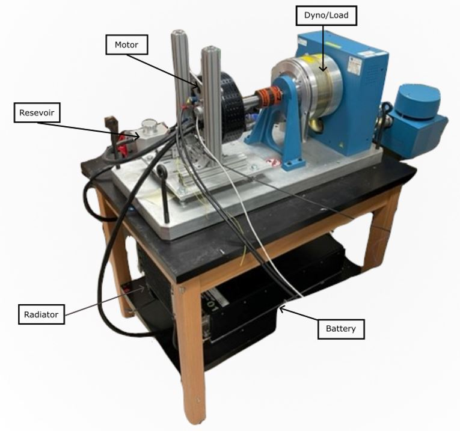

# Multi-domain Powertrain Model of Electric Light Aircraft
Multi-domain modeling of general aviation electric light aircraft powertrain.

## Pipistrel Velis Electro

This project is generally focused on developing multi-physics (electrical, thermal, vibration) models of a light electric airplane. As a general goal, the team has chosen the Pipistrel Velis Electro as the target aircraft. However, the models developed here are not based on any real components within the Pipistrel Velis Electro, no information from Pipistrel was provided for this project, and the team does not have any involvement with Pipistrel or its suppliers. 

   
The Pipistrel Velis Electro, the light electric airplane that provides the general constraints of the developed models [Airjuice Photography, CC BY-SA 4.0 https://creativecommons.org/licenses/by-sa/4.0, via Wikimedia Commons].

## Multiphysics Model

This project is developing multiphysics models to enable the development of next-generation control methodologies and energy storage systems with increased safety for general light aviation. 

   
Multiphysics model of a general aviation electric light aircraft with thermal, mechanical, and three-phase power components.

## Testbed

The team has developed a power electronics testbed at USC to enable the cost-effective co-design of power electronics and energy storage systems. This testbed is approximately scaled to match the Pipistrel Velis Electro.

   
The general aviation electric light aircraft testbed at the University of South Carolina.

## Licensing and Citation

[![CC BY-SA 4.0][cc-by-sa-shield]][cc-by-sa]

This work is licensed under a
[Creative Commons Attribution-ShareAlike 4.0 International License][cc-by-sa].

[cc-by-sa]: http://creativecommons.org/licenses/by-sa/4.0/
[cc-by-sa-image]: https://licensebuttons.net/l/by-sa/4.0/88x31.png
[cc-by-sa-shield]: https://img.shields.io/badge/License-CC%20BY--SA%204.0-lightgrey.svg

Cite as:

@Misc{ARTSLabMultiDomainPowertrain,    
  author = {ARTS-Lab},  
  howpublished = {GitHub},  
  title  = {Multi-domain Powertrain Model of Electric Light Aircraft},
  groups = {ARTS-Lab},    
  url    = {https://github.com/ARTS-Laboratory/Multi-domain-Powertrain-Model-of-Electric-Light-Aircraft},   
}
